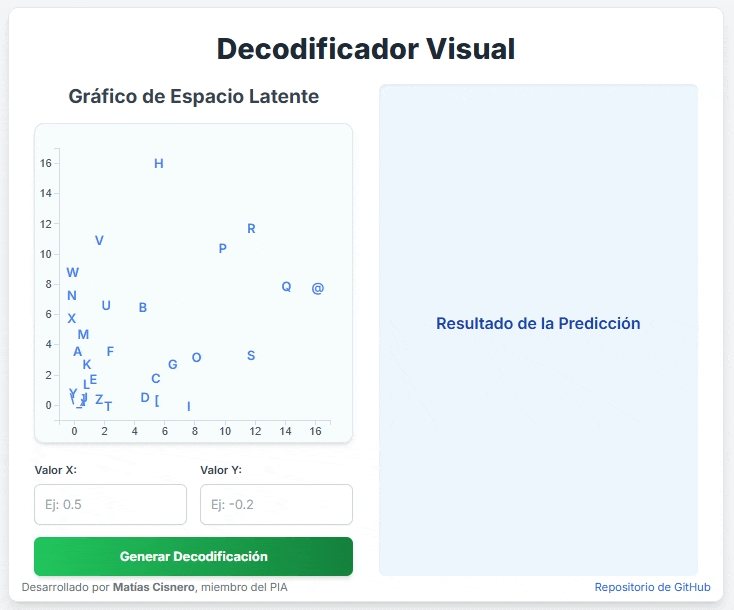

# 🧠 Autoencoder Intro IA

Este proyecto es una introducción práctica a los **autoencoders**, entrenado desde cero con NumPy y visualizado en un frontend interactivo.

* 📓 Entrenamiento en `autoencoder-numpy.ipynb`
* 🌐 Visualización y generación de caracteres en [GitHub Pages](https://matias-cisnero.github.io/autoencoder-visual-demo/)



---

## 🔍 ¿Qué hace este proyecto?

* Entrena un **autoencoder básico** usando matrices binarias de caracteres (7x5).
* Aprende a codificar los datos en un **espacio latente** de menor dimensión.
* Permite:

  * Visualizar los datos codificados en un espacio 2D.
  * Generar nuevamente los caracteres originales a partir del decodificador.
  * Explorar el espacio latente y **crear nuevos caracteres**.

---

## ⚙️ Tecnologías utilizadas

* [Python 3](https://www.python.org/)
* [NumPy](https://numpy.org/)
* [Matplotlib](https://matplotlib.org/)
* [Jupyter Notebook](https://jupyter.org/)
* [HTML/CSS/JavaScript](https://developer.mozilla.org/en-US/docs/Web/Guide) para el frontend
* [GitHub Pages](https://pages.github.com/) para el despliegue

---

## 🧠 ¿Cómo funciona?

### 1. Entrenamiento del autoencoder

* En el notebook `autoencoder-numpy.ipynb`, se define y entrena una red neuronal simple **sin usar frameworks externos**.
* Se utilizan caracteres representados como **matrices binarias de 7x5**.
* El autoencoder se entrena para codificar y luego reconstruir estos caracteres.

### 2. Visualización y generación

* El frontend permite:

  * Ver el espacio latente (2D) con los caracteres codificados.
  * Hacer clic en cualquier punto del espacio latente para **decodificarlo** y ver el carácter correspondiente.
  * Usar los **últimos pesos del decodificador entrenado** exportados desde Python para la generación en tiempo real en el navegador.

---

## 🚀 ¿Cómo lo uso?

### 💻 Backend (Notebook de entrenamiento)

1. Clonar este repositorio:

   ```bash
   git clone https://github.com/matias-cisnero/autoencoder-intro-ia.git
   cd autoencoder-intro-ia
   ```

2. Abrir y ejecutar el notebook:

   * `autoencoder-numpy.ipynb`
   * Entrena el modelo y guarda los pesos del decodificador en formato JSON para el frontend.

---

### 🌐 Frontend interactivo

Visitalo directamente en:

🔗 [https://matias-cisnero.github.io/autoencoder-intro-ia/](https://matias-cisnero.github.io/autoencoder-visual-demo/)

* Hacé clic en cualquier punto del gráfico latente para generar un nuevo carácter.
* Probá recorrer el espacio y ver cómo cambia la salida del decodificador.

---

## 📁 Estructura del proyecto

```
autoencoder-intro-ia/
├── autoencoder-numpy.ipynb   <- Notebook con el entrenamiento
├── pesos_autoencoder.json      <- Pesos exportados del decodificador para el front
├── pesos_autoencoder.npy      <- Copia de pesos para el .ipynb
├── index.html                     <- Código del frontend 
└── README.md
```

---

## 🧠 Conceptos clave

* **Autoencoder**: red neuronal entrenada para reconstruir su entrada.
* **Espacio latente**: representación comprimida de los datos.
* **Decodificador**: parte del modelo que convierte la codificación latente en salida visible.

---

## ✨ Créditos

Proyecto realizado por [Matías Cisnero](https://github.com/matias-cisnero) como ejercicio práctico para comprender y experimentar con autoencoders de forma didáctica.

---

## 📌 Licencia

Este proyecto está bajo la licencia MIT.
