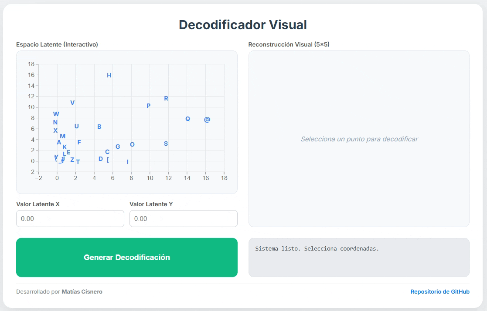

# 🧠 Autoencoder Intro IA

Herramienta interactiva para explorar el **espacio latente** y la decodificación (reconstrucción) de estos datos mediante autoencoders entrenados desde cero.

🚀 **[Probar Demo en Vivo](https://matias-cisnero.github.io/autoencoder-visual-demo/)**
📁 **[Repositorio GitHub](https://github.com/matias-cisnero/autoencoder-intro-ia)**



## 📁 Estructura del proyecto

```
autoencoder-intro-ia/
├── autoencoder-numpy.ipynb   <- Notebook con el entrenamiento
├── pesos_autoencoder.json      <- Pesos exportados del decodificador para el front
├── pesos_autoencoder.npy      <- Copia de pesos para el .ipynb
├── index.html                     <- Estructura del frontend
├── style.css                     <- Estilo del frontend
├── script.js                     <- Lógica del frontend
└── README.md
```

## ✨ Créditos

Creado por [Matías Cisnero](https://github.com/matias-cisnero).

## 📌 Licencia

Este proyecto está bajo la licencia MIT.
